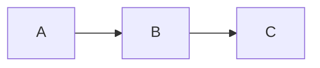

# Cornell Notes for Obsidian

Renders `cornell` fenced code blocks as a two-column
[Cornell Notes](https://en.wikipedia.org/wiki/Cornell_Notes) layout in Reading view.


---

## Features

- Two-column layout with configurable column widths (default 28% cues / 72% notes)
- Supports any Markdown in both columns: paragraphs, lists, tables,
  code blocks, callouts, math, mermaid diagrams, images, wikilinks
- Mobile-responsive: columns stack vertically on narrow screens
- Plain-text storage — readable and editable without the plugin
- Configurable headers, borders, and column widths via the settings page
  (or per-block with `::noheader`, `::header`, `::borders`, `::columns` directives)

---

## Installation

### Community plugins (once approved)

Settings > Community plugins > Browse > search **Cornell Notes** > Install > Enable

### Manual install

1. Download `main.js`, `manifest.json`, `styles.css` from the
   [latest release](https://github.com/bytetiles/obsidian-cornell-notes/releases/latest)
2. Copy all three files into `<your-vault>/.obsidian/plugins/cornell-notes/`
3. Settings > Community plugins > enable **Cornell Notes**

### Via BRAT (beta)

1. Install [BRAT](https://github.com/TfTHacker/obsidian42-brat)
2. BRAT > Add Beta Plugin > `https://github.com/bytetiles/obsidian-cornell-notes`

---

## Usage

Wrap your Cornell Notes rows in a 4-backtick `cornell` fence.
Use `::cue` to start a row and `::note` to start the note for that row.

````cornell
::cue
What is a window function?
::note
A calculation across related rows **without collapsing** them.

Unlike GROUP BY, all original rows stay visible.

::cue
What does PARTITION BY do?
::note
Splits rows into logical groups inside the window.

| PARTITION BY | GROUP BY       |
|--------------|----------------|
| keeps rows   | collapses rows |
````

### Syntax rules

| Element           | Syntax                                                   |
|-------------------|----------------------------------------------------------|
| Start a new row   | `::cue` on its own line                                  |
| Switch to note    | `::note` on its own line                                 |
| Cue-only row      | `::cue` with no following `::note`                       |
| Code block inside | use ` ```lang ``` ` (safe inside 4-backtick outer fence) |

> **Always use 4 backticks** for the outer fence (` ````cornell `).
> This lets you freely use triple-backtick code blocks inside.

### Block directives

Directives go before the first `::cue` in a block and override the vault-wide
default for that block only. Vault-wide defaults are set in
**Settings → Community plugins → Cornell Notes**.

| Directive                          | Effect                                               |
|------------------------------------|------------------------------------------------------|
| `::noheader`                       | Hide the header row                                  |
| `::header Cues \| Notes`           | Custom column labels (pipe-separated)                |
| `::borders solid`                  | Border style: `solid` / `dashed` / `dotted` / `off` |
| `::borders dashed 2pt/1pt #4A90D9` | Style + accent/row thickness + hex color             |
| `::columns 20`                     | Cue column width in % (10–90)                        |

### Rich content examples

**Code block in notes:**


````cornell
::cue
Java import syntax
::note
```java
import org.example.project.Course.*;
```
````

**Callouts, math, diagrams:**

````cornell
::cue
> [!tip] Tip in cue
::note
> [!warning] Warning callout

Inline math: $E = mc^{2}$

$$\int_0^\infty e^{-x^2}\,dx = \frac{\sqrt{\pi}}{2}$$

::cue
Mermaid in note
::note

````


### Mobile view

On screens narrower than 700 px the columns stack vertically
(cues first, then notes below).


## Known limitations

| Feature                           | Status                                                            |
|-----------------------------------|-------------------------------------------------------------------|
| `~sub~` / `^sup^` Obsidian syntax | ✗ Not rendered — use `<sub>` / `<sup>` HTML or Unicode (`₂`, `²`) |
| Live Preview two-column layout    | ✗ Reading view only — edit mode shows plain text                  |
