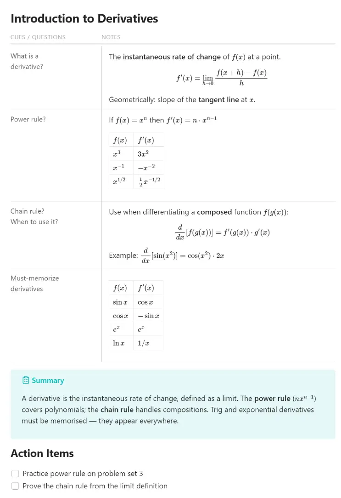

# Cornell Notes for Obsidian

Renders `cornell` fenced code blocks as a two-column
[Cornell Notes](https://en.wikipedia.org/wiki/Cornell_Notes) layout in Reading view.



---

## Features

- Two-column layout: **Cues / Questions** (28%) left, **Notes** (72%) right
- Supports any Markdown in both columns: paragraphs, lists, tables,
  code blocks, callouts, math, mermaid diagrams, images, wikilinks
- Mobile-responsive: columns stack vertically on narrow screens
- Plain-text storage — readable and editable without the plugin

---

## Installation

### Community plugins (once approved)

Settings > Community plugins > Browse > search **Cornell Notes** > Install > Enable

### Manual install

1. Download `main.js`, `manifest.json`, `styles.css` from the
   [latest release](https://github.com/bytetiles/obsidian-cornell-notes/releases/latest)
2. Copy all three files into `<your-vault>/.obsidian/plugins/cornell-notes/`
3. Settings > Community plugins > enable **Cornell Notes**

### Via BRAT (beta)

1. Install [BRAT](https://github.com/TfTHacker/obsidian42-brat)
2. BRAT > Add Beta Plugin > `https://github.com/bytetiles/obsidian-cornell-notes`

---

## Usage

Wrap your Cornell Notes rows in a 4-backtick `cornell` fence.
Use `::cue` to start a row and `::note` to start the note for that row.

````cornell
::cue
What is a window function?
::note
A calculation across related rows **without collapsing** them.

Unlike GROUP BY, all original rows stay visible.

::cue
What does PARTITION BY do?
::note
Splits rows into logical groups inside the window.

| PARTITION BY | GROUP BY       |
|--------------|----------------|
| keeps rows   | collapses rows |
````
